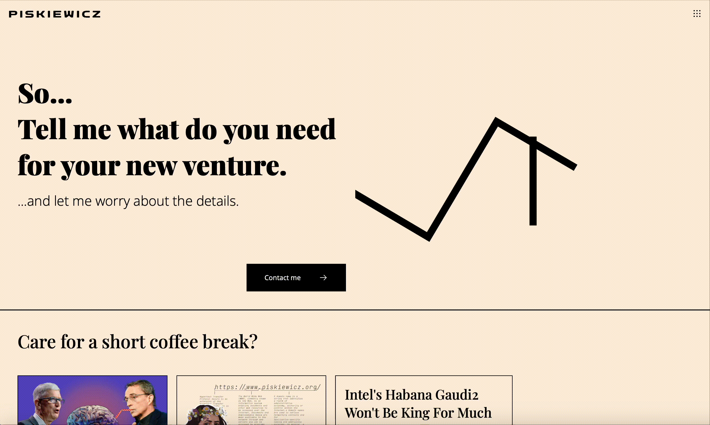

# portfolio-svelte

### Motivation

I've always wanted to start my own blog about programming. 
Instead of writing on platforms such as Medium I decided
to start my own portfolio website with a nice looking blog
section since this is a great way to show off my web development
skills in action.

### Technologies

I decided to go with SvelteKit because I like the fact that
the runtime for Svelte-based applications is small and with
SvelteKit it sometimes approaches close to zero JavaScript code
in the more static parts of the webpage. Other than that I just
happen to love writing stuff with Svelte.

TypeScript for me is an obvious choice for anything that has to
communicate with a REST API. I especially like code completion
for accessing object properties.

The back-end is a simple Python + Flask REST API. A MySQL database
which uses Connector/Python feeds content for the blog and collects
messages sent via the contact section's form.

I use a mix of [Material Design's](https://fonts.google.com/icons)
and [IBM Carbon Design System's](https://carbondesignsystem.com/guidelines/icons/library/)
icons. I think they fit the overall vibe of my portfolio well and
blend well with each other.

For the fonts i decided to go with PlayFair Display for
big titles and Open Sans for longer form text.
I also decided to use two variants of my favourite font - IBM Plex
for the interactive elements. IBM Plex Sans is used for buttons
and IBM Plex Mono - for the blog post tags that you can push
in order to search for posts with the same tags.
